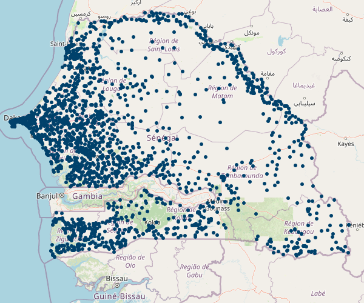

# Liste consolidée et géolocalisée des établissements de santé au Sénégal
_Pour la description en anglais, voir ci-dessous._    
_(For the description in English, please see below.)_

Il s'agit d'un dépôt de données hébergeant une liste consolidée et géolocalisée des établissements au Sénégal. Il a été développé à travers la collaboration entre l'Institut de Recherche en Santé, de Surveillance Épidémiologique et de Formation (IRESSEF), le Département de la Planification, de la Recherche et des Statistiques (DPRS), le Centre des Opérations d’Urgence Sanitaire (COUS), l'Agence Nationale de Statistique et de la Démographie (ANSD), et Exemplars in Global Health (EGH) de Gates Ventures.

Actuellement, cette liste inclut 4 685 établissements, parmi lesquels des hôpitaux, des centres de santé, des postes de santé et des cases de santé. 52 % de ces établissements sont actuellement géolocalisés (n = 2 423).

## Organisation
**data**: fichiers .csv et .xlsx des fichiers de données actuels et archivés.  
**codebooks**: informations détaillées sur les variables incluses dans l'ensembles de données.  
**resources**: rapports et publications associés à l'ensemble de données.  

## Articles
- Daouda M Gueye, Alioune Badara Ly, Babacar Gueye, Papa Ibrahima Ndour, Nancy Fullman, Patrick Y Liu, Khadim Mbaye, Aliou Diallo, Ibrahima Diatta, Saly Amos Diatta, Mouhamadou Moustapha Mane, Gloria Ikilezi, Moussa Sarr. "Vers la création d'une base de données de la liste complète des établissements au Sénégal: 
approches et résultats de la triangulation des données existantes sur les établissements de santé." (_En anglais_) https://www.medrxiv.org/content/10.1101/2023.05.22.23290283v2

## Citation
Veuillez utiliser la citation suivante pour ces données:

Institut de Recherche en Santé, de Surveillance Épidémiologique et de Formation (IRESSEF), Département de la Planification, de la Recherche et des Statistiques (DPRS), Centre des Opérations d’Urgence Sanitaire (COUS), Agence Nationale de Statistique et de la Démographie (ANSD) et Exemplars in Global Health (EGH). Liste consolidée et géolocalisée des établissements de santé au Sénégal. Version du 15 juin 2023.

## Conditions d'utilisation
Ce dépôt de données GitHub et son contenu présenté ici, incluant toutes les données, la cartographie et l'analyse, les droits d'auteur 2023 de l'IRESSEF, du DPRS, du COUS, de l'ANSD, et de l'EGH, tous droits réservés, sont fournis au public pour appuyer l’élaboration de politiques, la planification, l'éducation et la recherche universitaire. Le site Web integredes données provenant de plusieurs sources qui peuvent diverger. Nous déclinons par la présente toute responsabilité et garantie concernant le site Web, y compris son exactitude, son aptitude à l'usage et sa qualité marchande. 

# A consolidated and geolocated list of health facilities in Senegal
_For the description in French, please see above._  
_(Pour la description en français, voir ci-dessus.)_

This is a data repository for a consolidated and geolocated facility list in Senegal. It was developed by a collaboration between Institute for Health Research, Epidemiological Surveillance and Training (IRESSEF), Department of Planning, Research, and Statistics (DPRS), Public Health Emergency Operations Center (COUS), National Agency of Statistics and Demography (ANSD), and Exemplars in Global Health (EGH) at Gates Ventures.

At present, this facility list includes 4,685 facilities that are hospitals, health centers, health posts, and health huts. 52% of these facilities are currently geolocated (n=2,423).

## Organization
**data**: .csv and .xlsx files of current and archived data files.  
**codebooks**: detailed information on variables included in the dataset.  
**resources**: reports and publications associated with the dataset.  

## Articles  
- Daouda M Gueye, Alioune Badara Ly, Babacar Gueye, Papa Ibrahima Ndour, Nancy Fullman, Patrick Y Liu, Khadim Mbaye, Aliou Diallo, Ibrahima Diatta, Saly Amos Diatta, Mouhamadou Moustapha Mane, Gloria Ikilezi, Moussa Sarr. "Toward building a master health facility list database in Senegal: approaches and outputs from triangulating secondary health facility data." _Pre-print:_ https://www.medrxiv.org/content/10.1101/2023.05.22.23290283v2

## Citation
Please use the following citation for these data: 

Institute for Health Research, Epidemiological Surveillance and Training (IRESSEF), Department of Planning, Research, and Statistics (DPRS), Public Health Emergency Operations Center (COUS), National Agency of Statistics and Demography (ANSD), and Exemplars in Global Health (EGH). A consolidated and geolocated list of health facilities in Senegal. Version 15 June 2023.

## Terms of use
This GitHub repository and its contents herein, including all data, mapping, and analysis, copyright 2023 by IRESSEF, DPRS, COUS, ANSD, and EGH, all rights reserved, is provided to the public to support policy-making, planning, education, and academic research. The Website relies upon data from multiple sources that do not always agree. We hereby disclaims any and all representations and warranties with respect to the Website, including accuracy, fitness for use, and merchantability.
